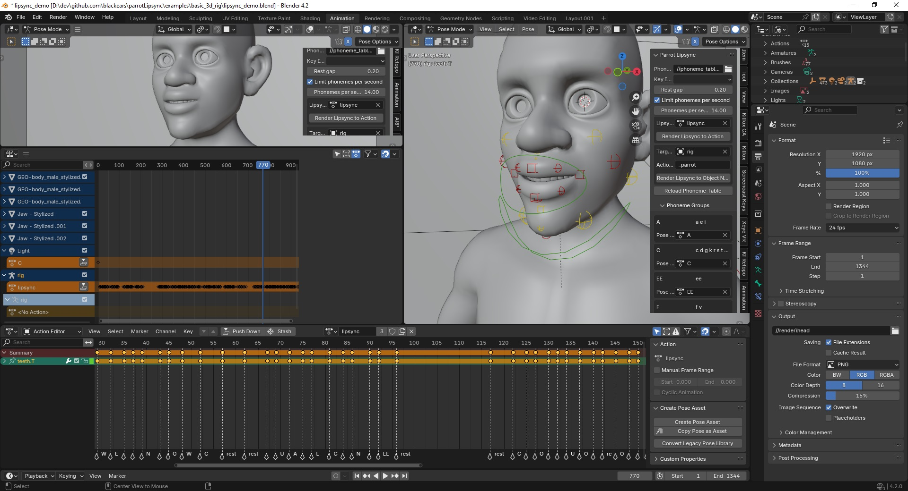

# Parrot Automatic Lipsync for Blender

This is an addon for Blender that lets you automatically generate lip-synced data from audio tracks.  It can be used for both 2D and 3D animations and supports many common languages.  It uses OpenAI's Whisper library to turn spoken audio tracks into words, and then Gruut to turn words into phonemes to create the key frames for your mouth positions.

[](https://www.youtube.com/watch?v=VCXyHdBmBwQ)

## Installation

Parrot Lipsync relies on you having some other applications already installed on your computer.

### Install Ffmpeg

Ffmpeg is a popular library that lets you read and write many popular media files.  It needs to be accessible from the command line.

Open a command prompt and type the following to see if it is already installed:

```
ffmpeg -version
```

If ffmpeg has not been found, you will need to install it.

```
# on Ubuntu or Debian
sudo apt update && sudo apt install ffmpeg

# on Arch Linux
sudo pacman -S ffmpeg

# on MacOS using Homebrew (https://brew.sh/)
brew install ffmpeg

# on Windows using Chocolatey (https://chocolatey.org/)
choco install ffmpeg

# on Windows using Scoop (https://scoop.sh/)
scoop install ffmpeg
```


### Install Whisper and Gruut

You will need to install some Python extensions to your Blender distribution of Python.  Blender uses its own copy of Python, so you will need to install these packages there even if you already have Python installed elsewhere on your system.

Open a terminal window and go into your Blender installation's python directory (on Windows it should be something like `C:\Program Files\Blender Foundation\Blender 4.0\4.0\python\bin`).  Then issue the following commands:

```
./python.exe -m pip install --upgrade numpy
./python.exe -m pip install --upgrade whisper_timestamped
./python.exe -m pip install --upgrade gruut
```

For MacOS and Linux, the following should work:

```
./python -m pip install --upgrade numpy
./python -m pip install --upgrade whisper_timestamped
./python -m pip install --upgrade gruut
```

Some languages will require additional packages to be installed:

```
Russian:
./python.exe -m pip install --upgrade gruut-lang-ru
```


### Installing the ParrotLipsync addon

You can install the addon by:
* opening Blender's `Edit/Preferences` menu
* opening the Addons section
* clicking the Install button 
* browsing to the `parrot_lipsync.zip` file

Once installed, make sure that you check the box to enable it.  A new tab will appear in the viewport right hand tab menu.

## Usage

Once installed, click on the Parrot Lipsync panel to access Parrot's controls.



You can then configure various parameters:

### General Parameters

* Whisper library - Language library Whisper uses for AI translation
* Phoneme Table - Table used to map phonemes to mouth poses
* Key interpolation - Way to interpolate between mouth poses.  It is recommended that you use `bezier` for 3D and `constant` for keyframe animation.
* Silence cutoff - During processing, a frame is considered to be silent if the audio track is below this value for the entire frame.  Used to positioning of words.
* Word pad frames - The number of frames to pad at the begining and end of words before placing a `rest` pose.
* Strength multiplier - Pose stength is multiplied buy this value.  Set to less than 1 to soften the animation.
* Track volume multiplier - If checked, the volume of the track at a particular frame will be used to adjust the strength of this frame.  Can be used to make the mouth poses more extreme when the speaker is being loud and less extreme when the voice is quiet.
* Auto detect language - Automatically determine the language being used by examining the audio data
* Language code - You can specify the language code to be used here if `auto detect language` is not checked

### Lipsync Action Paramaters

This generates an action based on audio data.  This action is added to the project's actions and is not assigned to any particular object.  You must have added an audio track to the `Video Sequencer` and selected it as the active object.

* Lipsync Action - Action object that will have it's data replaced with the data generated for this audio track.  If blank, a new action will be created.

Press the `Render Lipsync to Action` button to generate the action.

### NLA Action Paramaters

This uses Blender's NLA editor to generate the animation action and then add it to the target object's NLA tracks.  NLA tracks will be generatd for all selected tracks in the `Video Sequencer`.

* Target object - Object action will be created for
* Action name suffix - This string will be appended to the names of any actions generated to help you keep track of them

Press the `Render Lipsync to Action` button to generate the NLA tracks and actions.

### Phoneme Groups

This is a list generated by reading the phoneme table.  It lists every Phoneme group deacribed in the table and has a `Pose Action` field for each group that lets you define the mouth position for each group.  You'll need to provide poses for each entery in the table for Parrot to generate lipsync tracks.

If the Phoneme Groups are not showing, or if you want to load a different table, click the `Reload Phoneme Table` to rebuild the table.

## Running in headless mode

A script has been included in `/examples/headless_example/run_headless.py` that demonstrates running Parrot from the command line without having to launch Blender first.  

Run blender headless from the command line with the following command:

```
blender -b headless_demo.blend -P run_headless.py
```

run_headless.py:

```
import bpy

# Set Parrot operator properties
bpy.context.scene.props.target_object = bpy.data.objects['rig']

# Generate the lipsync
bpy.ops.parrot.render_lipsync_to_object_nla()

# Save the result
bpy.ops.wm.save_as_mainfile(filepath="//headless_result.blend")
```

## Editing the Phoneme Table

Parrot Lipsync uses a separate JSON file which defines what mouth positions to use and which phonemes are used for which mouth positions.  By default it will use the file named `phoneme_table_en.json` which comes with the addon.  This file can be edited to change which mouth position groups are used and which phonemes should be used for each mouth position.

If you wish to define your own phoneme table, it is recommended that you make a copy of `phoneme_table_en.json`, add your customizations to it and then set the `Phoneme table file` field of the Parrot UI to point to your custom file.


### Description of the Phoneme table

The phoneme table has two main sections:

The `groups` section defines each mouth position that your animation will use.  The groups are what you will assign mouth poses to in the addon UI.  The `name` field defines the name of the group and the `description` field lets you add some descriptive text to explain to the user what sounds this mouth pose is meant to make (and which is displayed as a hint).  The groups will also always include a special group called `rest`, even if you do not explicitly define it in the JSOn file.  The `rest` group is meant to represent the mouth when it is closed between words.

The `phonemes` section is where you let Parrot know which phoneme symbols belong to which group.  The `code` field is the International Phonetic Alphabetic code for the syllable and the `group` field indicates which mouth pose group the syllable belongs to.  The `class` and `example` fields are not currently used by Parrot but meant to provide usage hints to the user and might be used in a future version of Parrot.


## Acknowledgements

Whisper AI
https://github.com/openai/whisper

Gruut
https://rhasspy.github.io/gruut/index.html

Blender Base Meshes:
https://studio.blender.org/training/stylized-character-workflow/base-meshes/


## Support

If you found this software useful, please consider buying me a coffee on Kofi.  Every contribution helps me to make more software:

[](https://ko-fi.com/Y8Y43J6OB)

