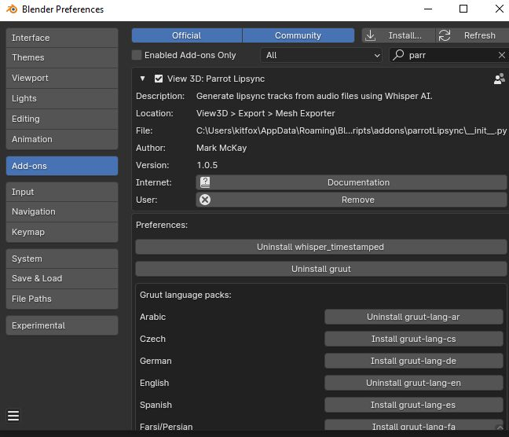

## Installation

Parrot Lipsync relies on you having some other applications already installed on your computer.


### Install Ffmpeg

Ffmpeg is a popular library that lets you read and write many popular media files.  It needs to be accessible from the command line.

Open a command prompt and type the following to see if it is already installed:

```
ffmpeg -version
```

If ffmpeg has not been found, you will need to install it.

```
# on Ubuntu or Debian
sudo apt update && sudo apt install ffmpeg

# on Arch Linux
sudo pacman -S ffmpeg

# on MacOS using Homebrew (https://brew.sh/)
brew install ffmpeg

# on Windows using Chocolatey (https://chocolatey.org/)
choco install ffmpeg

# on Windows using Scoop (https://scoop.sh/)
scoop install ffmpeg
```


### Installing the Parrot Lipsync addon

Now that ffmpeg is installed, you can install Parrot by opening the `Edit > Preferences > Addons` window and clicking the `Install` button.  Browse to the Parrot Lipsync zip file you downloaded and select it.  Finally, make sure the check mark next to `View 3D: Parrot Lipsync` is checked so that the addon is activated.

### Install Whisper and Gruut

Parrot needs some support libraries to function.  The easiest way to install them is to open Parrot's configuration page in the `Addon` window to reveal the buttons on the bottom.  Press the `Install whisper_timestamped` and `Install gruut` buttons to ensure these necessary libraries are added to your Blender's python packages.  Some languages will require an additional package - for example, if you intend to use the Russian language, make sure to click the `Install gruut-lang-ru` button as well.




### Alternate installation procedure for Whisper and Gruut

It is also possible to install Whsiper and Gruut on the command line as well if you don't want to use the installation panel.

Open a terminal window and go into your Blender installation's python directory (on Windows it should be something like `C:\Program Files\Blender Foundation\Blender 4.0\4.0\python\bin`).  Then issue the following commands:

```
./python.exe -m pip install --upgrade whisper_timestamped
./python.exe -m pip install --upgrade gruut
```

For MacOS and Linux, the following should work:

```
./python -m pip install --upgrade whisper_timestamped
./python -m pip install --upgrade gruut
```

Some languages will require additional packages to be installed:

```
Russian:
./python.exe -m pip install --upgrade gruut-lang-ru
```


## Support

If you found this software useful, please consider buying me a coffee on Kofi.  Every contribution helps me to make more software:

[](https://ko-fi.com/Y8Y43J6OB)

